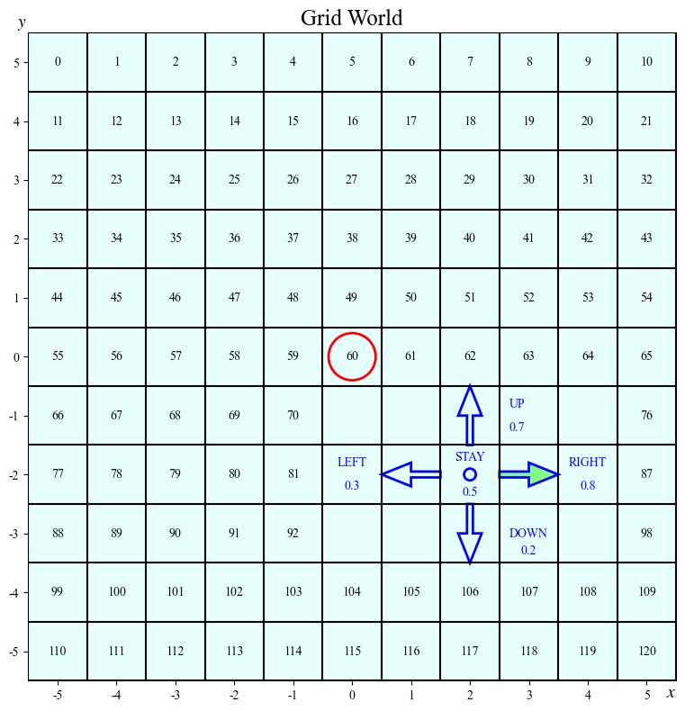

# Grid World Experiment of Robust Online RLHF — P2R + UCBVI-BF

This repository is an experimental implementation of the Preference-to-Reward (P2R) interface combined with the UCBVI-BF optimistic planner in grid world environment. The aim is to study learning from noisy pairwise $(s,a)$ preferences.

The code implements:
- A tabular GridWorld environment and a simulated comparison oracle with logistic link function;
- A simple P2R interface that converts (potentially noisy) $(s,a)$ preferences to (robust) scalar reward estimates;
- A UCBVI-BF planner that performs optimistic backward value iteration to learn optimistic Q-values.


## Requirements

All you need is just basic dependencies:
- Python 3.8+ (recommended)
- numpy
- matplotlib
- seaborn

Install with pip:
```bash
pip install -r requirements.txt
```


## Quick Start

```bash
# run default experiment (without noise in comparison oracle)
python main.py -K 100000

# run noisy experiment (with a random probability of flipping preference labels)
python main.py -K 100000 -G 0.2

# run noisy experiment with robust P2R
python main.py -K 100000 -G 0.2 --robust
```

Command-line options:
- `--seed`: Random seed. Default is 42.
- `--result_dir`: Output directory. Default is `./results/`.
- `-K/--trajectory_num`: Number of trajectories. Default is 1000. But for satisfactory performance, it is recommended to be set larger than 100,000.
- `-H/--trajectory_length`: Length of a single exploration. Default is `5`. (do not modify!)
- `-G/--comparison_gamma`: Flip probability of binary preference oracle. Default is `0.0`.
- `--robust`: Flag to enable robust P2R correction. If set, use robust P2R; otherwise, use regular P2R.


## Experiment Outputs

Each run of `main.py` creates a timestamped experiment directory under `./results/experiment_<timestamp>_<S>_<A>_<K>_<H>...`. The directory contains:
* `objects.pkl`: Python pickle file containing the RL algorithm objects like `ucbvi_bf` and recording variable objects like `trajectory_reward_list`.
* `log.log`: Log file of the experiment.
* Plots


## Project Structure

```
.
├── README.md
├── constants.py       # global hyperparameters
├── env.py             # grid world environment and simulated human comparison oracle
├── policy.py          # grid policy containers
├── p2r.py             # P2R_Interface for tabular (s,a) preferences
├── ucbvi.py           # UCBVI_BF planner
├── main.py            # top-level experiment runner
├── utils/                
|   ├── __init__.py
|   ├── functions.py   # helper functions
|   ├── log.py         # log settings
|   └── plot.py        # plotting functions
├── results/           # default output directory (created at runtime)
├── requirements.txt   # pip requirements
└── .gitignore
```

## Terminology

The notations used in the `README.md` and code comments are summarized below:

| Symbol         | Meaning                                                             |
| -------------- | ------------------------------------------------------------------- |
| $S$            | Size of state space                                                 |
| $A$            | Size of action space                                                |
| $H$            | Length of each trajectory                                           |
| $K$            | The total number of trajectories                                    |
| $s$            | State                                                               |
| $s'$           | Next state                                                          |
| $a$            | Action                                                              |
| $h$            | Time step in a trajectory                                           |
| $k$            | Trajectory index                                                    |
| $Q_{k,h}(s,a)$ | Estimated Q-value for $(s,a)$ at time step $h$ up to trajectory $k$ |
| $\pi_k$        | Greedy time-conditioned policy up to trajectory $k$                 |
| $r$            | Scalar reward                                                       |

- **Trajectory**: a sequence of `(h,s,a,s',r)` tuples.
- **Episode**: In this project we only consider (s, a) preferences, so each state-action pair is treated as an episode $\tau=(s,a)$. A trajectory contains multiple episodes.

## Main Logic

Each experiment iteration `k = 1..K` does:

1. **Planning**: The UCBVI-BF planner iterates over every $(h,s,a)$:
    - For each $(h,s,a)$, with the historical buffer of visited trajectories, use P2R to obtain a scalar reward estimate $\hat{r}(s,a)$.
    - Compute $Q_{k,h}(s,a)=\min\Big(\hat{r}(s,a)+\hat{V}_{h+1}+\text{bonus}(h,s,a),Q_{k-1,h}(s,a),H-h\Big)$. Here `bonus` is Bernstein-Freedman style.
    - Induce a greedy time-conditioned policy $\pi_k$ from the learned Q-values.

2. **Execution**: run a single trajectory of length `H=5` under the current policy $\pi_k$. Record `(h,s,a,s',r)` tuples to UCBVI-BF buffer. Here the reward signals are unseen by the models and are only used for performance evaluation.


## Detailed Settings

**Environmeng setup.** The environment is a $11\times11$ grid, which consists of all integer coordinates in $[-5,5]\times[-5,5]$. The agent always starts from the center of the grid, i.e., $(0,0)$. The agent has five possible actions: *stay*, *right*, *up*, *left*, and *down*, with mean reward $0.5,0.8,0.7,0.3,0.2$, respectively. The environment dynamics are defined as: when the agent takes an action, with probability $p=0.9$, it will move to the desired direction, and with probability $1-p=0.1$, it will choose an action from *stay*, *right*, *up*, *left* *down* with equal probability. The optimal policy is to move right ($a=1$) for each state $s$.

**State action notations.** We use tuple $(s,a)$ to represent the state-action pair. Here $a$ is an integer in $\{0,1,2,3,4\}$ representing the five actions respectively. $s$ is an integer in $\{0,1,\ldots,120\}$ representing the agent's state. It starts from $0$ in the upper left corner, increases by $1$ when moving right, and increases by $11$ when moving down. The position $(0,0)$ corresponds to state $60$. The baseline trajectory $\tau_0$ as the reference for human comparison is $(60,\textit{stay})$.

**Agent environment interaction.** In our setting, we only consider $(s,a)$ preferences. Each state-action pair is treated as an *episode*, i.e., $\tau=(s,a)$. For the convenience in this context, we define a *trajectory* to be the aggregation of state-action pairs (episodes) in each exploration, i.e., $(s_0,a_0,\ldots,s_4,a_4,s_5)$. The agent will interact with the environment for $K$ trajectories. For each trajectory, it always starts from the center of the grid, and take $H=5$ steps (so the total number of episodes is $KH$). This setting belongs to tabular MDP of which the state and action space are finite.




## Related Works

- **P2R**: <a href="https://proceedings.neurips.cc/paper_files/paper/2023/hash/efb9629755e598c4f261c44aeb6fde5e-Abstract-Conference.html">Is RLHF More Difficult than Standard RL? A Theoretical Perspective</a> (Wang et al. 2023)
- **UCBVI-BF**: <a href="https://proceedings.mlr.press/v70/azar17a">Minimax Regret Bounds for Reinforcement Learning</a> (Azar et al. 2017)


## License & Contact

This project is just experimental research code for personal use. It is not intended for public use or distribution. If you are interested and have questions or concerns, please contact me at Github.
